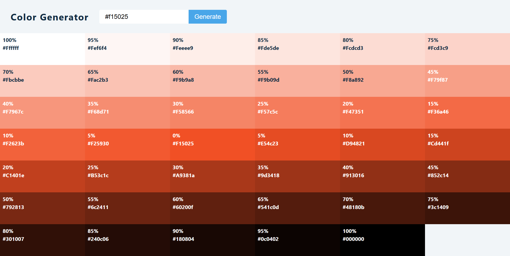

# Color Generator

A React application that generates tints and shades of a given color. Users can input a hex color code to generate a palette and copy color values to the clipboard with a single click.

## Features

- **Color Generation**: Generate darker and lighter shades of any hex color input.
- **Clipboard Integration**: Click on any color box to copy its hex value to the clipboard.
- **Error Handling**: Visual feedback for invalid color codes.
- **Responsive Design**: Works seamlessly across different screen sizes.

## Setup Instructions

In the project directory, you can run:

### `npm install`

Installs the necessary dependencies to run the app.

### `npm start`

Runs the app in the development mode.\
Open [http://localhost:3000](http://localhost:3000) to view it in your browser.

The page will reload when you make changes.\
You may also see any lint errors in the console.

## Technologies Used

- React
- Values.js (for color manipulation)
